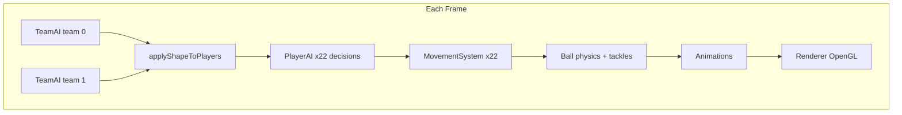
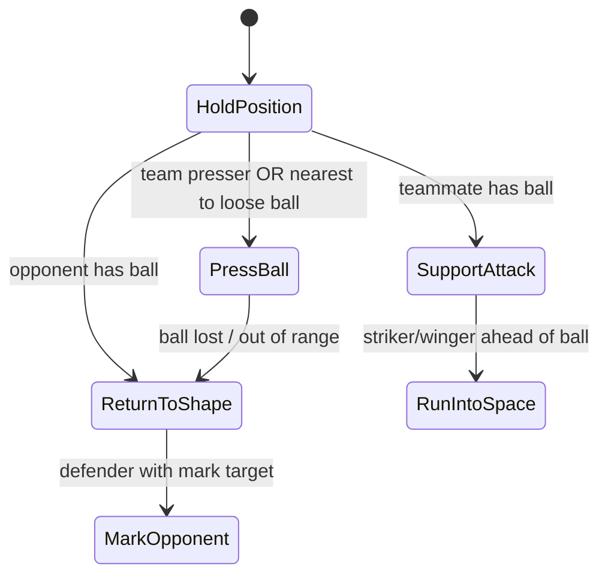

# 2D Football — FM-Style AI Architecture

## Design goals

| Goal | How |
|------|-----|
| No zombie ball-chasing | Team AI picks **one presser**; others **hold shape** |
| FM-like positioning | Formation + shape shift + defensive line |
| Scalable code | Small systems with clear responsibilities |
| OpenGL = render only | All rules in `MatchSimulator` + AI modules |
| Beginner-friendly | Plain C++ classes, few dependencies |

---

## High-level flow



---

## Layer responsibilities

### 1. `MatchSimulator` (orchestrator)
- Owns players, teams, ball, score, clock, phase
- **Does not** decide tactics — calls subsystems in order
- File: `include/fm/MatchSimulator.hpp`, `src/MatchSimulator.cpp`

### 2. `TeamAI` (team layer)
- Defensive line height
- Press intensity (from zone + mentality)
- **Who presses** (nearest eligible) + **who covers**
- Marking assignments for defenders
- Builds shaped slots via `FormationLibrary`
- File: `include/fm/TeamAI.hpp`, `src/TeamAI.cpp`

### 3. `PlayerAI` (individual layer)
- State machine → target position → action (pass/shoot/dribble/move)
- File: `include/fm/PlayerAI.hpp`, `src/PlayerAI.cpp`

### 4. `FormationLibrary` (team shape)
- Templates: **4-4-2**, **4-3-3**, **4-2-3-1**
- Parameters: `lineHeight`, `width`, `shiftAmount`, `compactness`
- Shifts shape with ball X/Y
- File: `include/fm/Formation.hpp`, `src/Formation.cpp`

### 5. `TacticalZones`
- Defensive / middle / attacking third (per team)
- Feeds press intensity
- File: `include/fm/TacticalZones.hpp`, `src/TacticalZones.cpp`

### 6. `PassingSystem`
- Scores pass options (forwardness, distance, risk, through-ball)
- Safe passes preferred; switch play bonus
- File: `include/fm/PassingSystem.hpp`, `src/PassingSystem.cpp`

### 7. `MovementSystem`
- Acceleration toward `targetPos`
- **Separation** so teammates do not stack
- Display smoothing (separate from simulation `pos`)
- File: `include/fm/MovementSystem.hpp`, `src/MovementSystem.cpp`

### 8. `Renderer`
- Draw pitch, players, ball only
- File: `include/fm/Renderer.hpp`, `src/Renderer.cpp`

---

## Player state machine



| State | Movement target |
|-------|-----------------|
| `HoldPosition` | `shapeHome` |
| `ReturnToShape` | `shapeHome` |
| `PressBall` | Ball or ball carrier |
| `MarkOpponent` | Marked opponent (slightly goal-side) |
| `SupportAttack` | Near carrier, ahead + lateral |
| `RunIntoSpace` | Ahead run for through ball |

---

## Pressing rules (anti-zombie)

1. `TeamAI::assignPressing` finds **one** `presserId` per team (closest eligible).
2. `coverId` = second closest — tracks carrier / passing lane.
3. All other outfield players → `ReturnToShape` or `MarkOpponent`.
4. Loose ball: **only** the single nearest teammate enters `PressBall` within radius; others stay in shape.

---

## Tactical roles

Defined in `fm/Tactics.hpp` (`Role` enum).

| Role | AI effect |
|------|-----------|
| `Striker` | Runs into space, higher shot appetite |
| `Winger` | Wide support, switch-play target |
| `CentralMid` | Link play, more passes |
| `DefensiveMid` | Holds shape, marks, safe passes |
| `CenterBack` / `Fullback` | Marking, defensive line clamp |
| `Goalkeeper` | Never press, slower movement |

---

## Folder layout

```
include/fm/     Headers (API)
src/            Implementations
src/main.cpp    Win32 loop only
main.c          Legacy C version (optional)
ARCHITECTURE.md This document
```

---

## Step-by-step implementation order

1. **Math + Pitch + Tactics enums** — `Math.hpp`, `Pitch.hpp`, `Tactics.hpp`
2. **Entities** — `Player`, `Team`, `Ball`
3. **FormationLibrary** — slots + shape shift
4. **TacticalZones** — thirds + press intensity
5. **TeamAI** — line, presser, cover, marks
6. **PlayerAI** — state machine + targets
7. **MovementSystem** — accel + separation
8. **PassingSystem** — evaluate + execute
9. **MatchSimulator** — glue + ball rules
10. **Renderer** — OpenGL only
11. **main.cpp** — window + loop

### Future expansions (same architecture)

- [ ] Set pieces (corners, free kicks)
- [ ] Player attributes (`passing`, `pace`, `vision`)
- [ ] Heatmaps / debug draw for states
- [ ] JSON formation loader
- [ ] Different team mentalities per half

---

## Build (CodeBlocks)

1. Open `2d football.cbp`
2. Build target uses **C++** sources under `src/`
3. Include path: `include`
4. Flags: `-std=c++17 -Wall`
5. Link: `opengl32`, `gdi32`

Legacy `main.c` is kept for reference; the FM AI build uses `src/main.cpp`.
